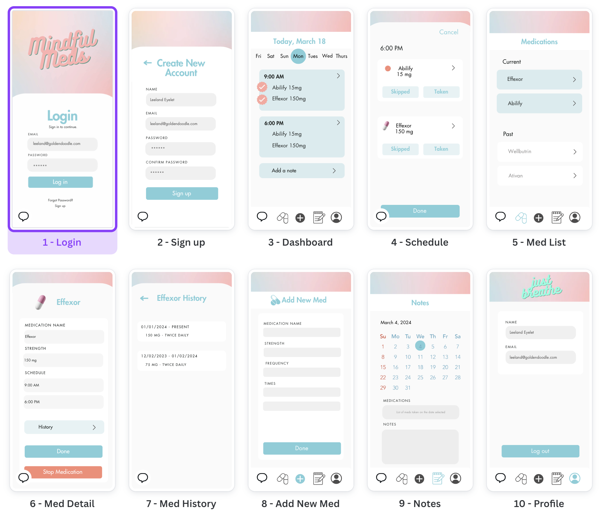

# Mindful Meds

## Overview


- Medication tracking app, focusing on people who take medication for treating mental illnesses.


## Problem


- Mental illnesses often require a cocktail of medications to treat, and multiple attempts at finding the right combination. This app will help people track the different medications (current and past) and their corresponding doses. This may be especially helpful for times when transitioning meds - either tapering off or adding new medications. Notes for any negative or positive affects can be added in the app and either brought to the attention of the doctor, or used as a reference in the future.

## User Profile

- People who take medication for mental illness.
- Looking for a way to keep track of medications
- Mobile app experience

## Features

- Unique user profiles with log in, log out, and sign up functionality
- Add current medications and corresponding medication schedule. Include the name of the medication, the dose, frequency, and times when medication is to be taken
- Add notes on any symptoms/ side effects. Will either be in calendar or list format. Should show a list of medications that were currently being taken at that time.
- Show a history of past medications with the date, and dosage

# Implementation

## Tech Stack


- React.js
- SASS
- Material UI
- Node
- Express
- Axios
- Knex
- MySQL
- JWT


## APIs

- No external API's

## Sitemap

  - Register
  - Log in 
  - Dashboard
      - Popup/modal to log or skip dose. User can also navigate to the medication details page by clicking on the card
  - Medications
  - Add new med
  - Notes
  - Profile
  

## Mockups



## Data


- Users table
    - primary key: user id
    - email
    - password
    - name

- Medication table
    - primary key: med id
    - forgein key: user id
    - med name
    - boolean: active med

- Medication dose table
    - dose
    - frequency
    - list of times taken?
    - start date
    - end date
    - created_at
    - updated_at

- Notes table
    - primary key: note id
    - foreign key: user id
    - created_at
    - updated_at
    - note content


## Endpoints


### POST /auth/login

- Endpoint to log in a user

Parameters:
- email: User's email address.
- password: User's password.

Response:

```
{
    "token": "seyJhbGciOiJIUzI1NiIsInR5cCI6IkpXVCJ9.eyJzdWIiOiIxMjM0NTY3ODkwIiwibmFtZSI6I..."
}
```

### POST /auth/register

- Endpoint to create a new user

Parameters:

- email: User's email address.
- name: User's name.
- password: User's password.

Response:
```
{
    "token": "seyJhbGciOiJIUzI1NiIsInR5cCI6IkpXVCJ9.eyJzdWIiOiIxMjM0NTY3ODkwIiwibmFtZSI6I..."
}
```

### POST /med/add

- Endpoint to create a new medication

Parameters

- medication_name: The name of the medication.
- strength: The strength/dose of the medication.
- frequency: The frequency that the medication is taken.
- times: An array of times when the medication is taken.

```
    {
        "id": 1,
        "medication_name": "Abilify",
        "strength": "15mg",
        "frequency": "Once daily",
        "times": [
            "9:00 AM",
            "6:00 PM"
            ]
    }
```

### PUT /med/:id/update

- Endpoint to update/edit existing medication (notes or info)

Parameters:
- id: The ID of the medication to be updated.
- medication_name: The updated name of the medication.
- strength: The updated strength of the medication.
- frequency: The updated frequency when the medication is taken.
- times: Array of updated times when the medication is taken.

Response:

```
{
    "id": 1,
    "medication_name": "Abilify",
    "strength": "15mg",
    "frequency": "Once daily",
    "times": [
        "9:00 AM",
        "6:00 PM"
    ],
    "notes": [
        {
            "id": 1,
            "created_at": "timestamp",
            "updated_at": "timestamp",
            "note_content": "Lorem ipsum"
        }
    ]
}
```

### GET /user/:id
- Endpoint to get a user profile

Parameters:
- id: The ID of the user that we want to retrieve

Response: 
```
{
    "id": 123,
    "email": "leeland@goldendoodle.com",
    "name": "Leeland Eyelet"
}
```

### GET /user/:id/meds/active
- Endpoint to retrieve a list of all current meds for specified user

Parameters:
- id: The ID of the user that we want retrieved
- active: Include only the medications that are set to `active: true`

Response:

```
[
    {
        "id": 1,
        "user_id": 123,
        "medication_name": "Abilify",
        "strength": "15mg",
        "frequency": "Once daily",
        "times": [
            "9:00 AM",
            "6:00 PM"
        ],
        "notes": [
            {
                "id": 1,
                "created_at": "timestamp",
                "updated_at": "timestamp",
                "note_content": "Lorem ipsum"
            }
        ]
    },
    {
        // Details of any another active medications
    }
]
```

### GET /user/:id/meds/inactive
- Endpoint to retrieve a list of all past meds for specified user

Parameters:
- id: The ID of the user that we want retrieved
- inactive: Include only the medications that are set to `active: false`

Response:

```
[
    {
        "id": 1,
        "user_id": 123,
        "medication_name": "Abilify",
        "strength": "15mg",
        "frequency": "Once daily",
        "times": [
            "9:00 AM",
            "6:00 PM"
        ],
        "notes": [
            {
                "id": 1,
                "created_at": "timestamp",
                "updated_at": "timestamp",
                "note_content": "Lorem ipsum"
            }
        ]
    },
    {
        // Details of any other inactive medications
    }
]
```

### GET /user/:id/meds/:id
- Endpoint to retrieve medication details for specific medication

Parameters:
- id: The ID of the user that we want retrieved
- id: The ID of the medication that we want retrieved


Reponse:
```
{
    "id": 1,
    "user_id": 123,
    "medication_name": "Abilify",
    "strength": 15mg",
    "frequency": "Once daily",
    "times": [
        "9:00 AM",
        "6:00 PM"
        ],
    "notes": [
        {
        id: 1,
        "created_at": timestamp,
        "updated_at": timestamp,
        "note_content": "Lorem ipsum"
        }
    ]
}
```

### GET /user/:id/notes/:date

- Retrieve notes for a specified date. Includes information about medication that were active on the specified date

Parameters:
- id: The ID of the user.
- date: The specific date for the notes and active medications being requested.

Response:

```
[
    {
        "id": 1,
        "created_at": timestamp,
        "note_content": "Lorem ipsum",
        "medications": [
            {
                "id": 1,
                "medication_name": "Abilify",
                "strength": "15mg",
                "frequency": "Once daily",
                    times": [
                        "9:00 AM",
                        "6:00 PM"
                        ]
            },
            // Additional active medication objects at specified date
        ]
    }
]
```

## Auth

- There will be log in, log out, and sign up functionality
- This will be implemented with JWT

## Roadmap

Scope your project as a sprint. Break down the tasks that will need to be completed and map out timeframes for implementation. Think about what you can reasonably complete before the due date. The more detail you provide, the easier it will be to build.

FRONT END
- Initial folder structure and git repo
- Setup SASS variables, mixins, colors, fonts
- Assets: icons for menu, icons for tablet/capsule
- Setup react router
- Header component (pastel gradient)
- Menu/footer component (5 icons: home, pills, plus, notes, avatar)
- Log in page
- Sign up page
- Dashboard page (current date, "calendar" swipe of previous/future dates)
- Medication List page
- Add new med page
- Notes page
- Profile page
- Medication detail modal (from medicaiton list page)
- Schedule detail modal (from dashboard page)
- Components:
    - Header
    - Footer/Menu
    - Cards
    - Popup/modal
    - Calendar
    - Buttons
    - Inputs


BACK END
- Initial folder structure and git repo
- Database connection with knex
- Knex migrations and seeds

- POST /auth/login - Endpoint to log in a user
- POST /auth/register - Endpoint to create a new user
- POST /med/add - Endpoint to create a new medication
- PUT /med/:id/update - Endpoint to update/edit to existing med (notes or info)
- GET /user/:id - Endpoint to get a user profile: 
- GET /user/:id/meds/active - Endpoint to retrieve a list of all current meds for user (active:true)
- GET /user/:id/meds/inactive - List of all past meds for user (active:false)
- GET /user/:id/meds/:id - Endpoint to retireve medication details for specific medication
- GET /user/:id/notes/:date - Retrieve notes for a specified date. Includes information about medication that were active on the specified date


## Nice-to-haves


- Connect API with list of common meds. When adding a new med, could suggest meds while user is typing
- Keep track of current medication inventory. Enter the amount of pills you have and how many you need to take each day and the app will calculate the date at which you need a refill.
- Text/email/push reminders for when to take medications based on the schedule added, and also for refilling meds. Send a reminder to the user to take notes when starting a new medication or tapering off one.
