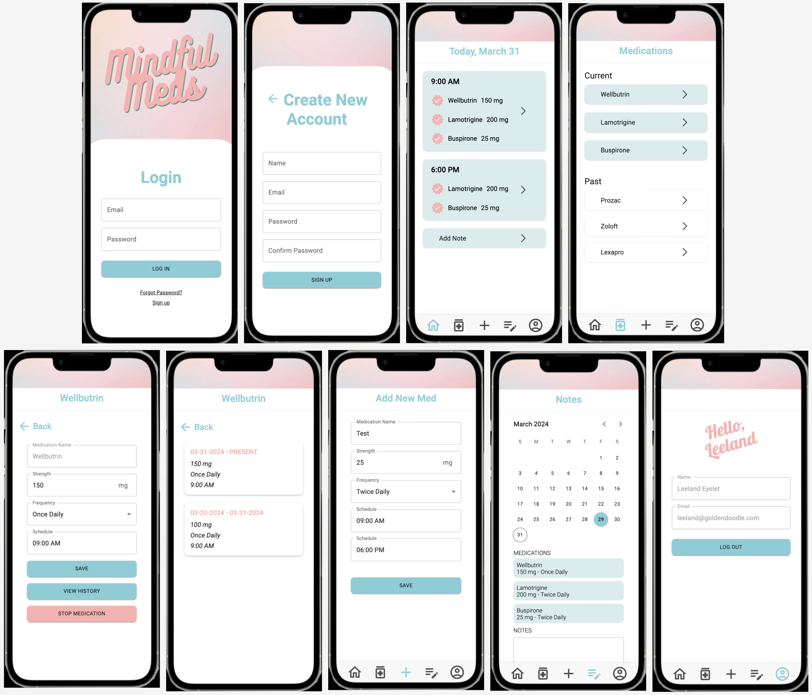
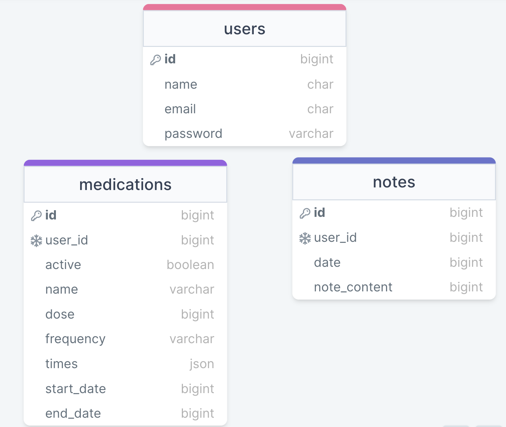

# Mindful Meds

## Overview

Mindful Meds is a medication tracking application designed for individuals managing mental illnesses.


## Problem

Treating mental illnesses often involves a complex combination of medications, necessitating careful monitoring and adjustment. Mindful Meds facilitates tracking current and past medications, along with their respective dosages. This is particularly beneficial during transitions, such as tapering off or introducing new medications. Users can record any side effects or benefits for discussion with their healthcare provider or for future reference.


## Local Installation / Setup

### Client repo (this one)
- Install Node packages
- Launch the application
- Open the device toolbar in Chrome Dev Tools and select *"iPhone 12 Pro"*
- Login credentials:
    - email: `leeland@goldendoodle.com`
    - password: `1234`

    ```
    npm install

    npm start
    ```

### Server repo ([link here](https://github.com/melanierawluk/mindful-meds-server))
- Install Node packages
- Set up the database
- Run migrations
- Seed the tables
- Start the server

    ```
    npm install

    npx knex migrate:latest
    npx knex seed:run --specific users.js
    npx knex seed:run --specific medications.js
    npx knex seed:run --specific notes.js

    node --watch server.js
    ```

## User Journey
**Login**
- Use the credentials provided in the seed files:
    - email: `leeland@goldendoodle.com`
    - password: `1234`

**Register**
- Upon registration, users are redirected to the login page.
    
**Dashboard** 

- Upon login, users are directed to the dashboard.
- The dashboard displays the current medication schedule, grouped by times and including dosages. *NOTE: The cards are not clickable at the moment*.
- Users can add notes directly from this page or navigate to the notes page via the bottom navigation menu.
- Future functionality: Implement a modal to log taken medications, with a verification icon appearing afterward.


**Medication List**
- Lists all current and past medications.

- Click each medication to view its details and history.

    - **Medication Details**: 
        - Users can view detailed information about each medication, edit dosage and frequency, and deactivate medications.
        - Deactivated medications are moved from the dashboard to the past medications list.

    - **Medication History**: 
        Displays past dose and schedule combinations for each medication.


**Add New Med**
- Allows users to add new medications with details such as name, dose, frequency, and scheduled times.
- Redirects users to the dashboard after a brief delay upon saving.

**Notes**
- Includes a calendar for users to view past medications and associated notes.
- *Future functionality*: Implement autosave for notes.

**Profile**
- Displays user information and allows logout.
- *Future functionality*: Enable users to edit their information.


## Additional Future Functionality

- Inventory Tracking: Monitor current medication supply and calculate refill dates.
- Reminders: Send notifications for medication intake and refills.
- Logging: Track when users log or skip medications.
- Swipe Date Functionality: Implement a horizontal scrollable calendar on the dashboard for easy date selection and medication logging.


# Implementation

## Tech Stack


- React.js
- SASS
- Material UI
- Node
- Express
- Axios
- Knex
- MySQL


## Visuals



## Database




## Endpoints

### GET /user/:userId
- Retrieves user profile information.

Parameters:
- userId: The unique identifier of the user to retrieve.

Response: 
```
{
    "id": 123,
    "email": "leeland@goldendoodle.com",
    "name": "Leeland Eyelet"
}
```

### GET /meds/:userId
- Retrieves a list of medications associated with a specified user. To retrieve only current medications, filter the response for those with `active: true`.

Parameters:
- userId: The ID of the user for whom to retrieve medications.

Response:

```
[
    {
        "id": 1,
        "user_id": 123,
        "active": true || false,
        "medication_name": "Abilify",
        "dose": "15mg",
        "frequency": "Once daily",
        "times": [
            "9:00 AM",
            "6:00 PM"
        ],
        "start_date": "timestamp",
        "end_date": "timestamp" || NULL
    },
    {
        // Objects of other medications
    }
]
```

### GET /meds/:userId/:medId
- Retrieves details of a specific medication for a given user.

Parameters:
- userId: The ID of the user.
- medId: The ID of the medication.


Reponse:
```
{
    "id": 5,
    "active": 0,
    "name": "Wellbutrin",
    "dose": "150 mg",
    "frequency": "Once daily",
    "times": [
        "9:00 AM"
    ],
    "start_date": "2024-03-20T06:29:50.000Z",
    "end_date": "2024-03-26T14:26:20.000Z",
    "created_at": "2024-03-20T06:29:50.000Z",
    "updated_at": "2024-03-26T14:26:20.000Z",
    "user_id": 1
}
```

### GET /meds/:userId/date/:date

- Retrieves medications taken on a specific date for a given user.

Parameters
- userId: The ID of the user.
- date: The date for which medications are requested (YYYY-DD-MM).

Response

```
[
    {
        "id": 1,
        "name": "Prozac",
        "dose": "20mg",
        "frequency": "Twice daily",
        "times": [
            "9:00 AM",
            "6:00 PM"
        ],
        "start_date": "2024-03-20T04:27:51.000Z",
        "end_date": "2024-03-26T14:21:42.000Z"
    },
]
```

### POST /meds/:userId/add

- Creates a new medication entry for a user.

Parameters

- userId: The ID of the user.

Request
```
{
    "name": "Buspirone",
    "dose": "60 mg",
    "frequency": "Once daily",
    "times": "6:00PM",
    "user_id": 1
}
```

Response
```
    {
        "id": 37,
        "active": 1,
        "name": "Buspirone",
        "dose": "50 mg",
        "frequency": "Once daily",
        "times": [
            "5:00PM"
        ],
        "start_date": "2024-03-26T15:42:33.000Z",
        "end_date": null,
        "created_at": "2024-03-26T15:42:33.000Z",
        "updated_at": "2024-03-26T15:42:33.000Z",
        "user_id": 1
    }
```

### POST /meds/:medId/update

- Creates a new entry in the database for a changed dose/frequency/times of medication.

Parameters:
- medId: The ID of the medication.

Request
```
{
    "name": "Buspirone",
    "dose": "60 mg",
    "frequency": "Once daily",
    "times": "6:00PM",
    "user_id": 1
}
```

Response
```
    {
        "id": 38,
        "active": 0,
        "name": "Buspirone",
        "dose": "60 mg",
        "frequency": "Once daily",
        "times": [
            "6:00PM"
        ],
        "start_date": "2024-03-26T15:47:00.000Z",
        "end_date": null,
        "created_at": "2024-03-26T15:47:00.000Z",
        "updated_at": "2024-03-26T15:47:00.000Z",
        "user_id": 1
    }
```


### GET /notes/userId/:date

- Retrieve notes for a specified date.

Parameters:
- userId: The ID of the user.
- date: The date for which notes are requested (YYYY-DD-MM).

Response:

```
{
    "id": 3,
    "date": "2024-03-21T06:00:00.000Z",
    "note_content": "Feeling pretty down today",
    "created_at": "2024-03-20T04:27:58.000Z",
    "updated_at": "2024-03-25T22:08:32.000Z",
    "user_id": 1
}
```


Response

```
{
    "id": 9,
    "date": "2024-03-11T06:00:00.000Z",
    "note_content": "Feeling energetic and optimistic",
    "created_at": "2024-03-26T15:57:36.000Z",
    "updated_at": "2024-03-26T15:57:36.000Z",
    "user_id": 1
}
```


### PATCH /notes/:userId

- medId: The ID of the medication.

Parameters:
- userId: The ID of the user.

Request

```
{
    "date": "2024-03-11",
    "note_content": "Feeling energetic and optimistic"
}
```

Response
```
{
    "id": 9,
    "date": "2024-03-11T06:00:00.000Z",
    "note_content": "Feeling energetic and optimistic",
    "created_at": "2024-03-26T15:57:36.000Z",
    "updated_at": "2024-03-26T15:57:36.000Z",
    "user_id": 1
}
```


### POST /notes/:userId

- Creates a new note for a specified user.

Parameters: 
- userId: The ID of the user.

Request

```
{
    "date": "2024-03-11",
    "note_content": "Feeling energetic and optimistic"
}
```


Response

```
{
    "id": 9,
    "date": "2024-03-11T06:00:00.000Z",
    "note_content": "Feeling energetic and optimistic",
    "created_at": "2024-03-26T15:57:36.000Z",
    "updated_at": "2024-03-26T15:57:36.000Z",
    "user_id": 1
}
```